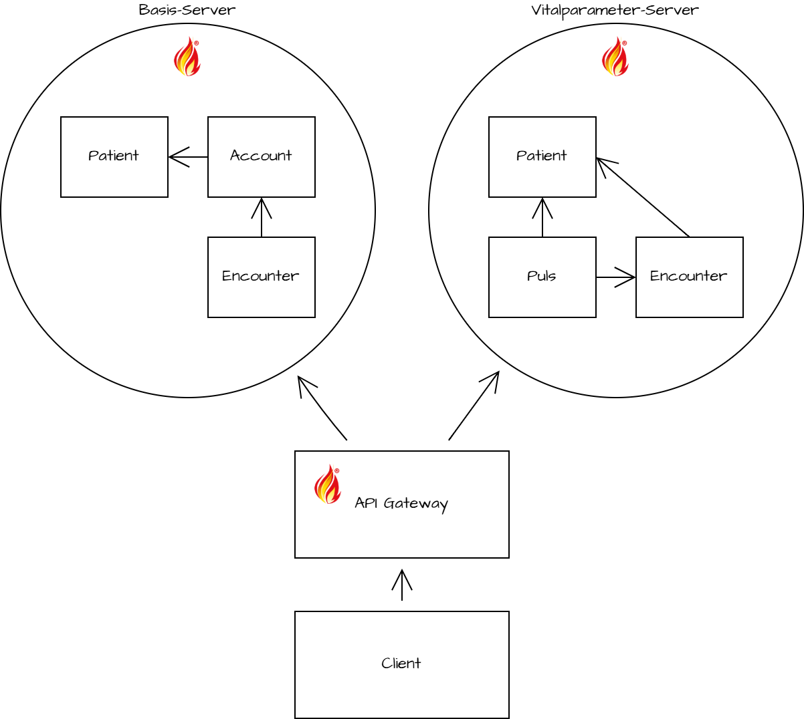
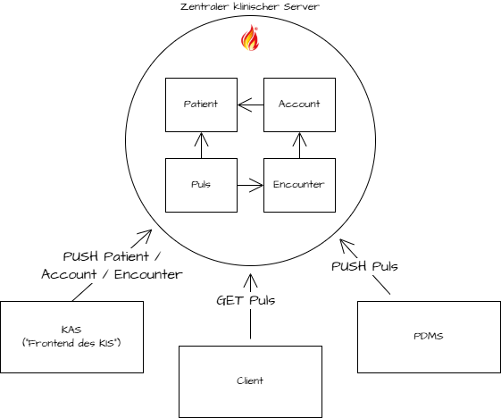
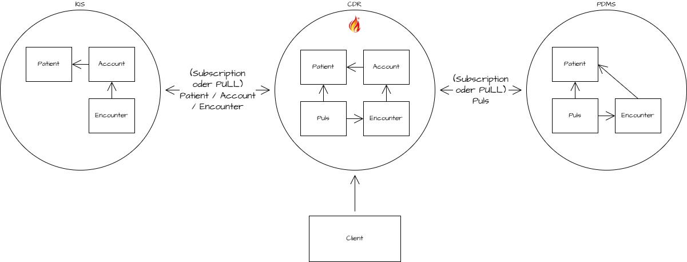

# Architektur-Optionen beim Parallelbetrieb unterschiedlicher ISiK-Server

## Problem

Fast alle im ISiK Kontext bestätigten Systeme nehmen die Rolle eines Servers ein. Im Beispiel des KIS als führendes System werden über ISiK Endpunkte die Ressourcentypen Patient, Account, Encounter und weitere in ISiK Basis definierte Profile bereitgestellt. Wird das Beispiel um ein PDMS (System auf Intensivstation) erweitert, welches ISiK-konform Vitalparameter bereitstellt, wird ein Problem deutlich: Der Client möchte alle medizinischen Informationen abfragen, die es zu einem bestimmten Patient gibt. Muss der Client jetzt mehrere FHIR-Server Endpunkte anfragen, sich Ressourcen zusammensammeln und dann entscheiden, welche Instanz die richtige ist? Ist die Instanz Patient aus dem KIS oder dem PDMS die richtige? Was passiert, wenn widersprüchliche Informationen zurück kommen?

Antworten auf diese Fragen und deren Implikationen zeigen im Folgenden die unterschiedlichen Architekturoptionen auf.

Neben den aufgeführten Architekturoptionen lassen sich auch Antipattern beschreiben, deren Umsetzung als eher problematisch anzusehen ist.

## Architektur-Optionen (und ihre Herausforderungen)

Für das beschriebene Problem gibt es verschiedene Lösungen, die unterschiedlich komplex sind. Anders ausgedrückt: die Komplexität wird in den unterschiedlichen Optionen verschiedene auf bestimmte Komponenten verteilt. Es ist jedoch nicht der Fall, dass eine Option grundsätzlich als mehr oder weniger komplex gegenüber den anderen Optionen erscheint.

Allen hier vorgestellten Optionen ist gemein, dass sie unnötige Komplexität - die Wahrung der Datenintegrität in einem verteilten System bringt diese zwangsläufig mit sich - auf Seite der Clients vermeiden. 

Prinzipiell sind die beschriebenen Optionen kombinierbar.

### API Gateway Schicht vor FHIR Servern

Die Grundidee dieser Option besteht darin, dass eine API Gateway Schicht vor den (ISiK-konformen) FHIR Servern vorgelagert wird, um einen einheitlichen Endpunkt für Clients bereitzustellen.

 <b>Details</b>

#### Beschreibung 

Es gibt *keine zentrale Persistenz mit FHIR API*, sondern ein zentrales FHIR API Gateway, das Anfragen an die dezentralen Ressourcen-Server (ISiK-Akteure) weiterleitet. 

In jedem *Server* werden die benötigten Ressourcen für den jeweiligen Use Case gehalten. 

Ein *API Gateway* kennt alle verfügbaren FHIR Server und kennt ggf. die Source of Truth für spezifische Profile (dies muss ggf. konfiguriert werden). Bei einer Suchanfrage wird dann ggf. an die richtigen Server geroutet und im Zweifel aus mehreren Servern die Resultate im Livestream aggregiert und zurück gegeben. Das API Gateway verfügt über keine eigene Persistenz-Schicht (jenseits von einfachem Caching), gibt aber als Endpunkt eindeutige und unveränderliche IDs für alle FHIR-Ressourcen aus, sodass jede Entität – ob Patient, Encounter oder andere Ressource – stets dieselbe ID behält. Die Konfigurationsoptionen des Gateways unterscheiden sich im Wesentlichen entlang der folgenden Aspekte:

Daten aggregieren
Deduplizieren (Redundanz unterbinden)
Definition einer Source of Truth

Ein *Client* interagiert mit dem API Gateway. 

#### Nachteile

- Latenzen sind zu erwarten durch Deduplizierung, Aggregation etc. im livestream

#### Vorteile

- Option ist umsetzbar mit bestehenden ISIK Lösungen
- Robustheit gegen Ausfall einzelner Systeme

#### Herausforderung in der Umsetzung 

- Konfiguration des API Gateways ist komplex und umfangreich
- Authentifizierung und Autorisierung mittels SMART hier ggf. komplexer als bei anderen Optionen (Hintergrund: Scope für Token entspricht Patient URL , aber diese URL weicht hier ab)  → ggf. zu Problemen

### Zentrale Persistenz mit FHIR API - Subsysteme als Clients

Diese Option kennzeichnet, dass ein Server als eine zentrale Datenpersistenz bereitsteht, die zugleich als FHIR Endpunkt fungiert. Der Server fragt die Daten nicht aktiv an, sondern erhält sie von den Subsystemen.

 <b>Details</b>

#### Beschreibung 

Es gibt nur **eine zentrale Persistenz mit FHIR API**, in die alle Ressourcen geschrieben werden müssen ("Zentrale Persistenz mit FHIR-Interface"; ist ggf. neue Rolle). Dieser Server würde potentiell jede Rolle implementieren, die bisher in ISiK vorgesehen ist und ggf. zusätzliche Funktionen (siehe Herausforderung). Der Server verfügt i.d.R. über komplexe Business-Logik (Plausibilisierung von Daten, Deduplizierung  etc.). Diese Option entspricht grob dem amerikanischem EHR Modell in Kliniken (ggf. inklusive SMART APP-Store).

**Systeme** müssen die in ihrem Use Case erzeugten Instanzen diesem Server aktiv bekannt machen.

**Clients** haben nur diesen einen Server, der als Ziel für Anfragen gewählt wird.

#### Nachteile

- Abhängigkeit zum zentralen Server wächst (Gatekeeper gegenüber Clients);
    - ggf. auch von eigenem Hersteller; mit Einschränkung: durch FHIR sollte Server-Wechsel zugleich leichter sein
- Persistenz der Subsysteme wird aufgegeben (d.h. keine Datenredundanz als Sicherheitsmechanismus)
- Verantwortung des Schreibens liegt bei Subsystemen

#### Vorteile

- Klare *source of truth* (inkl. Business-Logik wie Deduplizierung etc.)
- Zentrale und weniger komplexe Autorisierung
- *SMART on FHIR* Ansatz anwendbar
- Komplexe Datenanalyse wird weniger komplex

#### Herausforderung in der Umsetzung 

- Neue Interaktionen (CREATE) aus ISiK werden erforderlich (in der Spezifikation und für Hersteller); entspricht nicht dem status-quo
    - Mit Ausnahme: machbar über Rückübermittlung durch Subsysteme (Composition) 
- ggf. Komplexität zur Übergabe von Schreibrechte an externe Komponenten; z. B. muss für das CREATE, bzw. die Übergabe einzelner Profile die *source of truth* definiert werden

### Zentraler FHIR Endpunkt mit Datenpersistenz

Für diese Option gilt, dass ein Server von anderen Servern (Subsystemen) Daten aktiv anfragt. 
Clients stellen nur an diesen zentralisierten Server Anfragen, der damit als einziger Endpunkt fungiert.

 <b>Details</b>

#### Beschreibung 
Es gibt *eine zentrale FHIR API für Clients mit eigener Datenpersistenz*, die in (nahezu) Echtzeit aus den Subsystemen (Ressourcen-Server) vorhandene Daten abfragt und bereitstellt. Dieser Server würde potentiell jede Rolle implementieren, die bisher in ISiK vorgesehen und ggf. zusätzliche Funktionen (siehe Herausforderung). Der Server verfügt i.d.R. über komplexe Business-Logik (Plausibilisierung von Daten, Deduplizierung, insbesondere Patient matching  etc.). Auch diese Option entspricht grob dem amerikanischem EHR Modell in Kliniken (ggf. inklusive SMART APP-Store).

*Systeme* müssen die in ihrem Use Case erzeugten Instanzen diesem Server passiv (z. B. Subscription) bekannt machen.

*Clients* haben einen zentralen Server, der i.d.R. als Ziel für Anfragen gewählt wird.

Es gibt weiterhin mehrere Server, die als ISiK Akteure im Krankenhaus laufen. Einer dieser Server übernimmt die "führende" Rolle und sammelt die Daten von den anderen Servern. Dies kann mittels FHIR Subscription oder eines PULL Prinzip passieren. Clients fragen an diesem führenden Server ihre benötigten Informationen ab.

#### Nachteile
- Die Subsysteme (Ressourcen-Server) müssen _history-Funktion oder Subscription unterstützen
- MPI und Fall-Index wird benötigt
- Autorisierung ist verteilt und muss im zentralen Server aggregiert werden → ist ggf. analog zur anderen Option mit zentraler Datenpersistenz

#### Vorteile

- Es gibt weiterhin die Persistenz in den Subsystemen (Ressourcen-Servern): Redundanz als Sicherheits-Featur gegeben
- SMARTonFHIR Ansatz anwendbar (aber mit loser Kopplung und daher mehr Komplexität als in ZP-Option)
- Zentrale und (mutmaßlich) weniger komplexe Autorisierung 
- Komplexe Datenanalyse wird weniger komplex

#### Herausforderung in der Umsetzung 
- Die Frage, wer diese "führende" Rolle übernimmt, ist offen
- Bei mehreren ISiK Servern gleicher Rolle muss auch wieder das Clearing gelöst sein (Beispiel: mehrere Medikationsführende Systeme)
- Synchronisierungsmechanismus zwischen Servern in ISiK muss weiterentwickelt werden (z. B. mittels History-Funktion wird benötigt (z. B. für Labor-Abfragen; ggf. Erweiterung der Subscription-Funktionalität)
- Matchen der Objekte/IDs. bspw. bei Observations müssen Patienten mit abgerufen werden, und mittels Identifier der Patienten gematcht werden (MPI)

## Antipattern

Neben den genannten Architektur-Optionen sei an dieser Stelle noch auf zwei Antipattern hingewiesen:

### Clients unterstützen mehrere Serverendpunkte

In jedem Server werden die benötigten Ressourcen für den eigenen Use Case gehalten. Clients müssen alle verfügbaren Server kennen und wissen, welchen sie pro Use Case abfragen müssen. Ein Clearing von gleichen Instanzen muss auf Clientseite stattfinden.

Dies ist ein Antipattern, da hier die Komplexität zur Wahrung der Datenintegrität in einem verteilten System an die Clients delegiert wird.

###  Referenzen auf andere Server
Eine Ressource des einen Server referenziert auf eine Ressource, die auf einem anderen Server liegt. Pro Ressource/Profil gibt es nur einen Server der diese Daten vorhält.

Diese Umsetzungsvariante löst zwar das Problem der doppelten Instanzen und beugt potenziellen Clearing-Themen vor, jedoch sieht ISiK diese Form der Referenzierung bisher nicht explizit vor. Zudem wird auch hier Komplexität an die Clients delegiert wird.

## Fazit

Grundsätzlich sollten die zuletzt genannten Antipattern in der Umsetzung von Krankenhaus-IT-Landschaften auf Basis von ISiK gemieden werden.

Für die zuvor vorgestellten Architekturoptionen muss Kontext- und Fallabhängig entschieden werden, welche die beste Option darstellt.

