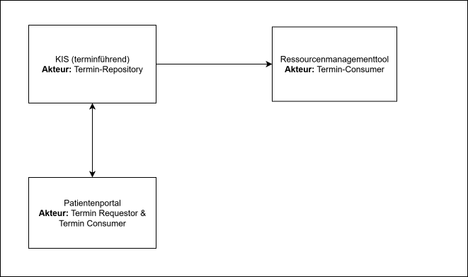
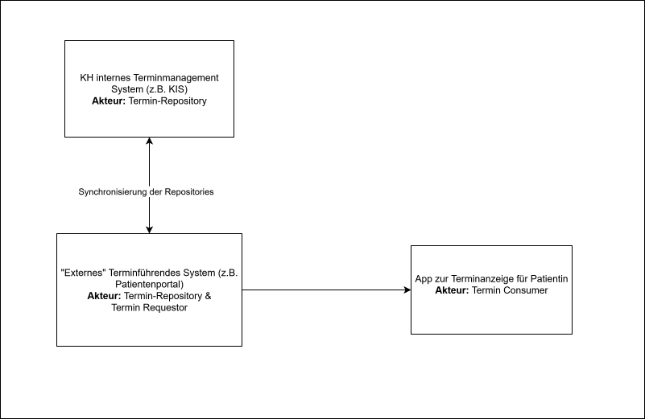

## {{page-title}}

Im folgenden werden beispielhafte mögliche Architekturen dargestellt, die das Zusammenspiel von Systemen im Kontext der Terminplanung darstellen.

### KIS als terminführendes System

Eine in der Praxis vermutlich häufig vorkommende Architektur sieht das KIS als terminführendes System, im Sinne des IGs ist es somit das Termin-Repository. Darüber hinaus existiert ein Patientenportal, über das Patienten online Termine buchen können. Das Patientenportal ist somit zugleich Termin-Requestor und Termin-Consumer.

### Patientenportal als Terminführendes System

Eine andere Variante ist das Patientenportal als terminführendes System einzubinden. In dieser Variente ist das KIS weiterhin auch als Repository zu betrachten, da Kapazitäten der Leistungserbringer hier vorgehalten werden. Das Patientenportal erhält jedoch weitergehende Rechte und kann hierdurch direkt Termine buchen. Eine bidirektionale Synchronisierung des Patientenportals und des KIS muss fortlaufend durchgeführt werden. 

