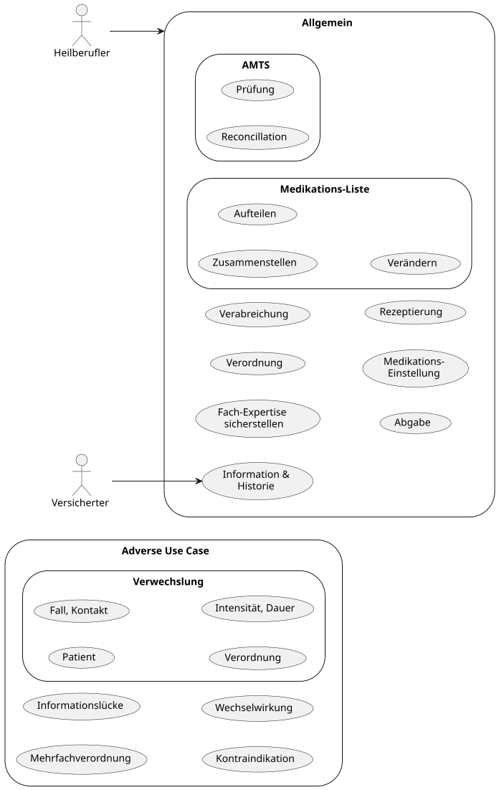

Im Folgenden wird ein grafischer Überblick über Anwendungsfälle (Use Cases) gegeben, die in diesem Modul relevant sind. Da es sich um eine Zusammenfassung handelt, werden nur folgende Use Case und dafür hinreichende Funktionen dargestellt:
* Allgemeine und intuitiv verständliche Use Cases.
  * Kombinationen und weitere Details sind möglich.
  * Übergreifende Use Cases und ihre Sub Use Cases können in einem separaten Diagramm auf den entsprechenden Seiten gefunden werden.
* Allgemeine und intuitiv Adverse Use Cases (diese gilt es zu vermeiden)
* In den Funktionen werden triviale Suchen einer Ressource anhand ihrer eigenen Properties nicht dargestellt, z.B. Suche einer Ressource anhand der ID, Name, Code usw.

Der Use-Case zum Thema Arzneimitteltherapiesicherheit (AMTS) wurde in einem eigenen Implementation Guide ausgelagert. Der Implementation Guide ist über folgenden Link erreichbar: [AMTS Implementierungsleitfaden](https://gemspec.gematik.de/fhir/ig/isik/amts/6.0.0-rc)

**Use Case Digramm**

<figure>
    

        
    

</figure>
