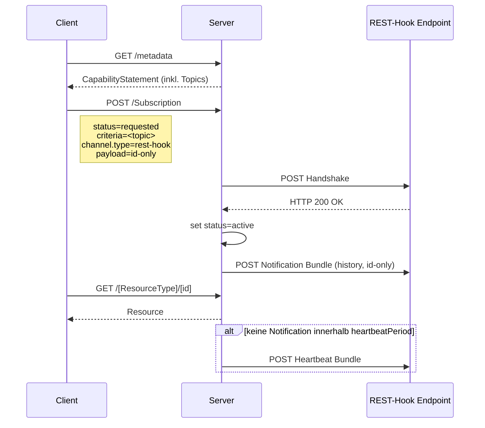
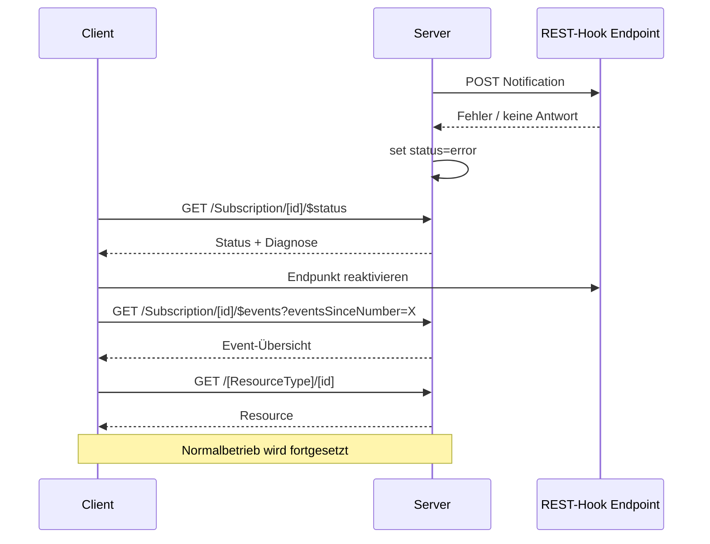

Es gelten die Interaktionen und der Workflow aus dem [Subscription Backport IG](https://hl7.org/fhir/uv/subscriptions-backport/workflow.html#workflow-fhir-r4).

### Subscription-Workflow

Der Subscription-Workflow umfasst die folgenden verpflichtenden Schritte:

#### 1. Topic Discovery (MUSS)

Clients MÜSSEN die vom Server unterstützten SubscriptionTopics abfragen können. Der Server MUSS die
unterstützten Topics über die Extension
[`capabilitystatement-subscriptiontopic-canonical`](https://hl7.org/fhir/uv/subscriptions-backport/StructureDefinition-capabilitystatement-subscriptiontopic-canonical.html)
im CapabilityStatement bekannt geben.

```
GET [base]/metadata
```

#### 2. Subscription-Anlage (MUSS)

Das Anlegen einer Subscription MUSS folgende Angaben unterstützen:

- **Topic** (`Subscription.criteria`): Canonical URL eines unterstützten SubscriptionTopics aus dem ISiKSubscriptionTopic CodeSystem.
- **Filterparameter** (`Subscription.criteria.extension:filterCriteria`): Optionale Einschränkung der Ereignisse.
- **Kanal** (`Subscription.channel.type`): MUSS `rest-hook` sein.
- **Payload** (`Subscription.channel.payload.extension[content]`): MUSS `id-only` sein. Die Notification enthält die ID der geänderten Ressource, aber keine vollständigen Ressourcendaten. Der Wert `full-resource` ist nicht zulässig.

```
POST [base]/Subscription
```

#### 3. Kanal-Handshake / Aktivierung (MUSS)

Nach der Anlage MUSS der Server einen Handshake-Aufruf am angegebenen REST-Hook-Endpunkt durchführen.
Bei einer erfolgreichen Antwort (HTTP 200 OK) MUSS die Subscription von `requested` auf `active`
gesetzt werden. Bei einem Fehler MUSS der Status auf `error` gesetzt werden.

Optional KANN der Handshake eine HTTP Basic Authentication mit einem statischen Secret
(`Subscription.channel.header`) verwenden.

#### 4. Notifications (MUSS)

Benachrichtigungen MÜSSEN als Bundle vom Typ `history` mit dem Entry `entry:subscriptionStatus`
gesendet werden. Notifications MÜSSEN `payload=id-only` verwenden — die Notification enthält
die ID(s) der geänderten Ressource(n), aber keine vollständigen Ressourcendaten.

Anhand der übermittelten ID ruft der Client die aktuelle Version der Ressource über die reguläre
FHIR-REST-API mit gültigem Autorisierungstoken ab (Pull-Prinzip).

#### 5. Heartbeat (MUSS)

Der Server MUSS einen Heartbeat senden, sobald die konfigurierte `heartbeatPeriod` seit der letzten
erfolgreich zugestellten Benachrichtigung (Notification oder Heartbeat) abgelaufen ist und in diesem
Zeitraum keine Notification erfolgt ist. Jede erfolgreiche Zustellung setzt den Zeitraum neu.

Der Heartbeat MUSS als Bundle mit `type=history` und einem Entry SubscriptionStatus mit
`notificationType=heartbeat` gesendet werden.

#### 6. `$status` Operation (MUSS)

Der Server MUSS die Operation `$status` unter `[base]/Subscription/[id]/$status` implementieren,
um Kanalzustand, letzte Events und Diagnosedaten zu prüfen.

```
GET [base]/Subscription/[id]/$status
```

#### 7. `$events` Operation (MUSS)

Der Server MUSS die Operation `$events` unter `[base]/Subscription/[id]/$events` unterstützen,
um verpasste Ereignisse nachzuliefern.

Die Filterparameter `eventsSinceNumber` und `eventsUntilNumber` MÜSSEN dabei unterstützt werden.

```
GET [base]/Subscription/[id]/$events?eventsSinceNumber=5&eventsUntilNumber=10
```

#### 8. Fehler- und Statushandling (MUSS)

Bei einem nicht erreichbaren REST-Hook-Endpunkt MUSS der Server den `SubscriptionStatus` auf `error`
setzen. Der Client KANN per `$status` den Fehler prüfen und den Kanal reaktivieren.

---

### Workflow-Sequenzen

#### Normalfluss



#### Fehlerfall



---

### Sicherheit

#### Grundprinzipien (MUSS)

- **id-only Payload in Notifications (MUSS)**: Benachrichtigungen enthalten die ID(s) der
  geänderten Ressourcen, aber keine vollständigen PHI-Daten. Clients rufen die Ressource nach
  Erhalt der Notification gezielt per ID ab (Pull-Prinzip). Der Wert `full-resource` ist nicht
  zulässig.

- **Keine Secrets in Subscription-Ressourcen**: In `Subscription.channel.header` DÜRFEN keine
  Klartext-Secrets dauerhaft gespeichert sein. Secrets sind bei Erstellung/Aktualisierung einmalig
  übermittelbar (Write-Only). Bei READ-Interaktionen MUSS der Server den Header-Wert maskieren
  (z.B. `Authorization: Basic ****last5`).

#### Autorisierung des REST-Hook-Endpunkts (OPTIONAL)

Da keine Payload in Notifications übertragen wird, ist die Authentifizierung des Empfängers optional.
Wenn genutzt, erfolgt sie über HTTP Basic Authentication mit einem statischen Secret in
`Subscription.channel.header`. Das Secret wird bei der Anlage einmalig angegeben und kann nicht
im Klartext ausgelesen werden.
